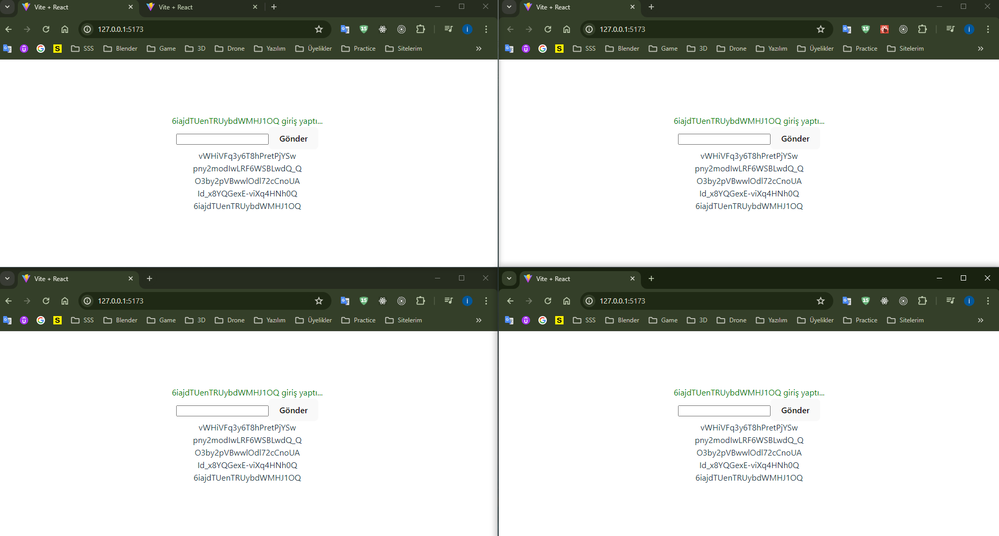
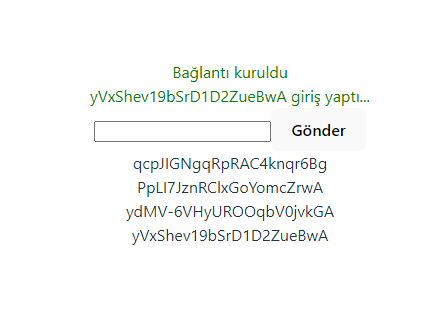
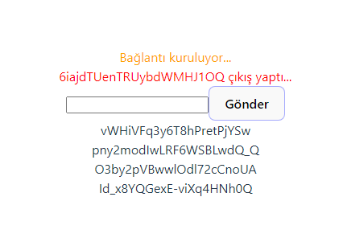
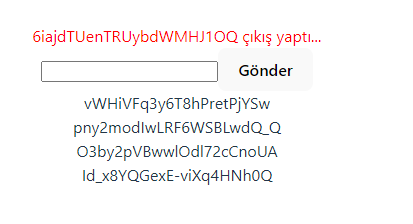

# 👋 SignalR Projesi  👋  

SignalR kullanarak basit istemci-sunucu uygulamasıdır.
Bağlantı durumları ve kullanıcı giriş-çıkışları ekranda gösterilmiştir.

## Teknolojiler
<p align="center">
  
  
  
  
  
</p>

- **Backend**: ASP.NET Core, SignalR
- **Frontend**: React-Vite, SignalR Client for JavaScript
- **Diğerleri**: HTML, CSS

## Kurulum

Projenin yerel makinenizde çalışması için aşağıdaki adımları izleyin.

### Gereksinimler

- [.NET 8 SDK](https://dotnet.microsoft.com/download/dotnet/8.0)
- [Node.js ve npm](https://nodejs.org/)
- [Git](https://git-scm.com/)

### Kurulum

1. Depoyu klonlayın:
    ```bash
    git clone https://github.com/ibrahimTaskin/SignalR.Project.git
    cd signalr-istemci-sunucu
    ```

2. Sunucuyu kurun:
    ```bash
    cd Server
    dotnet restore
    dotnet build
    dotnet run
    ```

3. İstemciyi kurun:
    ```bash
    cd ../Client
    npm install
    npm run dev
    ```

Sunucu `http://localhost:5001` adresinde ve istemci `http://127.0.0.1:5173/` adresinde çalışacaktır.

## Ekran Görüntüleri

<p align="center">
  
  
  
</p>


## Katkıda Bulunma

Katkılar memnuniyetle karşılanır! Lütfen depoyu forklayın ve değişikliklerinizle bir pull request oluşturun.

